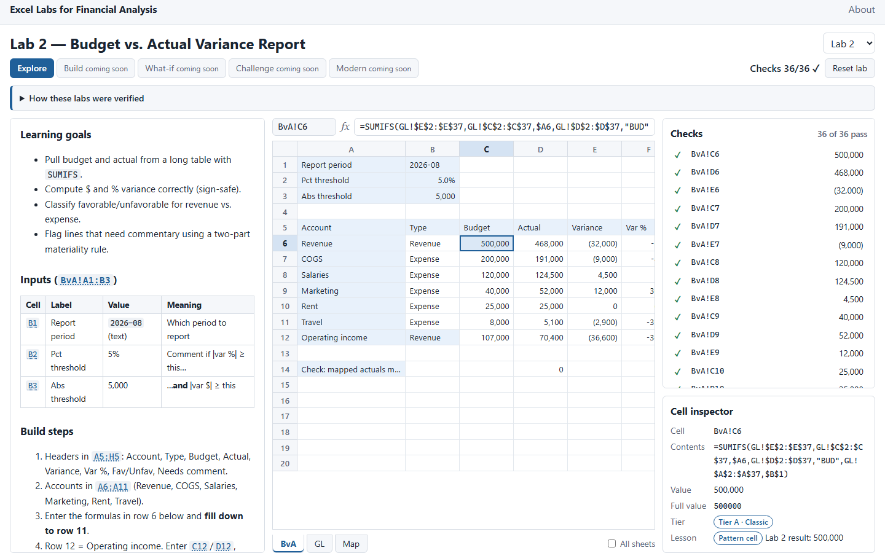
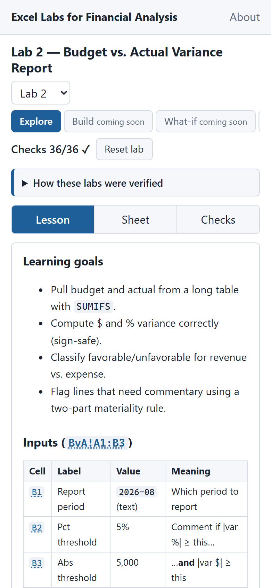
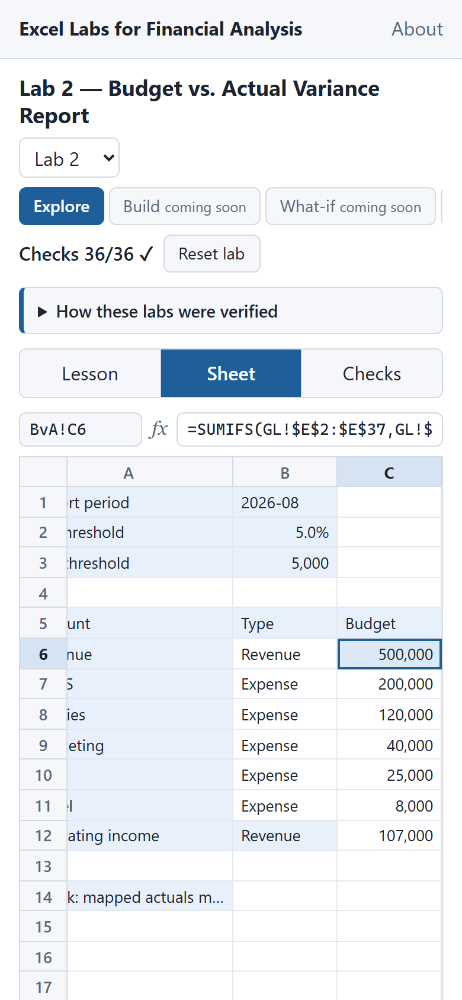

# Milestone 2: Grid + Explore Mode

**Branch:** `m2-explore` · **Date:** 2026-09-30 · **Status:** complete locally; awaiting owner review in [PR #3](https://github.com/jiaxingxue/finance-excel-labs/pull/3)

**Exit criterion (PRD §11 #3):** every lab loads with all checks green, clicking any cell link in a lesson selects it, and the formula bar and inspector work. **Met**, and covered by e2e tests.

## Screenshots

| Desktop (1440 × 900) | Phone (390 × 844): Lesson tab | Phone: Sheet tab |
|---|---|---|
|  |  |  |

Regenerate with `npm run build:pages` and then `npm run screenshots:m2`.

## What works

- **Route `/#/lab/:n`.** Home lab cards link to it. The page title is "Lab 7 — Bank Reconciliation · Excel Labs".
- **Lazy loading (PRD §8).** The page loads in three stages:
  1. The initial bundle.
  2. The lab route chunk (grid, markdown, SSF; 35 KB gzipped) plus a per-lab lesson chunk (1–4 KB).
  3. The engine chunk (HyperFormula, plugins, and `workbook.json`; 173 KB gzipped). LabWorkspace requests it only after the lesson has rendered.

  An e2e test holds the engine chunk's network request and confirms that the lesson is on screen while the grid still shows "Loading the formula engine…". The engine files import no HyperFormula except through `src/workspace/engineBundle.ts`. This rule is recorded in CLAUDE.md.
- **Layout, as approved.**
  - Desktop: lesson 30%, sheet 45%, checks and inspector 25%.
  - Tablet (768–1199 px): the lesson opens as a drawer from a "Lesson" button.
  - Phone (< 768 px): one panel at a time, chosen with [Lesson | Sheet | Checks]. The grid scrolls inside its own box, and an e2e test checks that the page never scrolls sideways.
- **Grid.**
  - GR-1: tabs for the lab's sheets, plus an "All sheets" toggle that shows the other labs' sheets read-only.
  - GR-2: SSF number formats; booleans as `TRUE`/`FALSE`; errors as Excel error text.
  - GR-4: edit by double-click, Enter, F2, or typing. Enter or Tab commits, Esc cancels, Delete clears.
  - GR-6: input cells are tinted, and changed cells flash for 600 ms (no flash with reduced motion).
  - GR-13: arrows, Shift to extend, Ctrl+arrow jumps with Excel's rules, Home/End, Page Up/Down, Ctrl+Page Up/Down between sheets.
  - Undo/redo with Ctrl+Z / Ctrl+Y.
  - The grid is a `role="grid"` table using `aria-activedescendant`, with a polite live region that announces the selected cell's address, value, and formula.
- **Typed input parsing.** `1,000` and `5%` become numbers, `TRUE`/`FALSE` become booleans, and a full `YYYY-MM-DD` becomes a date serial. Text periods such as `2026-08` stay text. A formula that references an unknown sheet shows a message instead of crashing.
- **Formula bar (GR-3).** It shows the name box and the formula or constant, and it doubles as an editor, which is how phone users edit.
- **Display rule (OPEN_ISSUES #19).** Cells without `fmt` use SSF `General`. The formula bar and inspector show numbers to 15 significant digits, and date-formatted constants show as `YYYY-MM-DD`. Grading always uses the full value. Tested with unit tests (including `Checks!C8` = `0.9999999999999999` → `1`) and e2e tests.
- **Cell inspector (EX-2).** It shows the formula, the formatted value, the full value to 15 digits, a tier badge (A–D), and "Pattern cell" with the lesson's Result text when the cell is in the lab's formula table. EX-2(c), per-cell explanations, is deferred (OPEN_ISSUES #26).
- **Checks panel (EX-4).** It lists the lab's assertions graded live, shows "expected …" when a check fails, and selects the cell when you click a row. The header shows "Checks 36/36 ✓". Pass/fail is always spelled out in words and an icon, never shown by color alone. "Reset lab" restores the Labs document's workbook (EX-3).
- **Lesson panel (LS-1, GR-11).** Lessons render as GitHub-flavored markdown, and ` ```excel ` blocks get light syntax highlighting. Cell links follow the three rules in OPEN_ISSUES #20. A link to another lab's sheet turns on "All sheets". On a phone, a link switches to the Sheet tab; on a tablet, it closes the drawer.
- **Verification notice (LS-4).** It appears as a collapsed banner on every lab and expanded on `/about`, with the app's note that it calculates with HyperFormula, not Microsoft Excel.
- **Tiers (`src/config/tiers.ts`).** A test checks them against the Part 0.3 table in the Labs document.

## Tests added

- **Unit (84 new; 482 total):**
  - display rule (`display.test.ts`)
  - input parsing (`parseInput.test.ts`)
  - link rules: all three rules, plus a sweep over every lab lesson and the rehype plugin (`lesson-links.test.ts`)
  - tier cross-check (`tiers.test.ts`)
  - selection, Ctrl+arrow, and the workbook store (`workspace.test.ts`)
- **E2E (27 new; 31 total):**
  - `verification.json` is real JSON reporting 277/277 and 12/12, not the 404.html shell (`verification.spec.ts`).
  - All 12 labs load with every check green and no console errors or foreign requests.
  - The lesson renders before the engine loads.
  - Four cell-link tests: qualified, bare, cross-sheet with `$` excluded, and Lab 7 linking qualified references only.
  - Two display-rule tests.
  - Editing, flash, undo, and reset.
  - Unknown sheet rejected with a message.
  - Keyboard navigation.
  - Read-only sheets behind "All sheets".
  - **axe-core: no serious or critical WCAG 2.1 A/AA violations on Lab 2.** Its first run found scrollable lesson tables and code blocks that keyboard users couldn't reach; they are now focusable.
  - Tablet drawer.
  - Phone tabs and no horizontal page overflow.

## Verification (`/verify`, local, 2026-09-30)

| Step | Result |
|---|---|
| `npm run extract -- --check` | 21 files up to date |
| Golden cross-check | 15/15 sheets, 277/277 assertions, 12/12 experiments deep-equal (18 tests) |
| `npm run lint` / `typecheck` | Pass / pass |
| `npm test` + `verification:write` | **assertions 277/277, experiments 12/12**; 482/482 tests in 11 files |
| `npm run build:pages` | Initial JS **137.5 KB gzipped** (budget 600 KB). Lazy: lab route 34.9 KB, engine 173.1 KB, lessons 1.2–3.7 KB each |
| `npm run test:e2e` | 31/31 passed; 3 skipped (the screenshot specs, which run only via `npm run screenshots:m2`) |

PRD §11: **#1, #2, #3 met.** #4–#15 belong to later milestones. #9 (Lighthouse, axe on every page, recalculation benchmark) is only started: axe runs on Lab 2.

## Decisions and changes made in M2

- The owner-approved answers and the new milestone mapping are recorded in OPEN_ISSUES #20–#24 and PRD v1.5 (§9.1, §12). In short: GR-7, GR-12, LS-2, and LS-3 move to M3; GR-8, GR-9, and GR-10 move to M4; Zustand moves to M5.
- **New dependencies.**
  - Runtime: `react-markdown` 10.1 and `remark-gfm` 4.0 (MIT). Their unified/micromark dependencies are MIT or ISC.
  - Dev only: `@axe-core/playwright` 4.13 (MPL-2.0; its `axe-core` dependency is also MPL-2.0).

  `THIRD_PARTY_NOTICES.md` is regenerated.
- **The initial bundle grew from 101 KB to 137.5 KB** because the verification notice, which is on `/about`, renders markdown. The heavy parts are all lazy.
- **Grading imports.** `src/grading/match.ts` now imports from `engine/address.ts` and `engine/types.ts` instead of `engine/index.ts`, so the checks panel doesn't pull HyperFormula into the lab chunk. Behavior is unchanged.
- **E2E typecheck config.** `tsconfig.e2e.json` typechecks Playwright specs with DOM types, which `page.evaluate` callbacks need. `tsconfig.node.json` excludes `tests/e2e`, so scripts and unit tests still don't see DOM globals.
- **Local `/verify` now writes `verification.json`** the way CI does before building (OPEN_ISSUES #27).
- **OPEN_ISSUES #17's example was wrong.** `Gl!` isn't a missing sheet, because sheet names are case-insensitive (#25). The code was already correct.
- `vite.config.ts` raises the chunk-size warning limit to 1,000 KB for the lazily loaded engine chunk.

## What's left / next

- **Owner:** review the PR and screenshots.
- **M3 (What-if + Challenge):** controls (needs the editorial ranges from OPEN_ISSUES #9), experiments, challenge cards, charts CT-1–CT-4, plus GR-7 precedent outlines, GR-12 conditional formatting, LS-2 "Show live cells", LS-3 live Result column, and possibly EX-2(c) (#26).

## Known issues

- **Bare references in running text aren't links.** Examples are "(C6, D6)" in the "How the key formulas work" bullets. This is by design (OPEN_ISSUES #20).
- **In-document anchors render as plain text.** Lab 1's link to Appendix C points at a section the app doesn't render.
- **Unsaved text in the formula bar is lost on blur**, e.g. when you type there and then click a cell. Enter commits. Committing on blur would write to the newly selected cell.
- **Long labels are cut at 11rem with an ellipsis** instead of overflowing into empty neighbors as in Excel. The full text is in the formula bar.
- **Text cells are tinted as inputs.** GR-6 tints every constant, so row and column labels are tinted too.
- **Reset clears undo history.**
- Carried over: OPEN_ISSUES #15 (TypeScript 6.0.x pin) and #18 (plugin scope limits).
