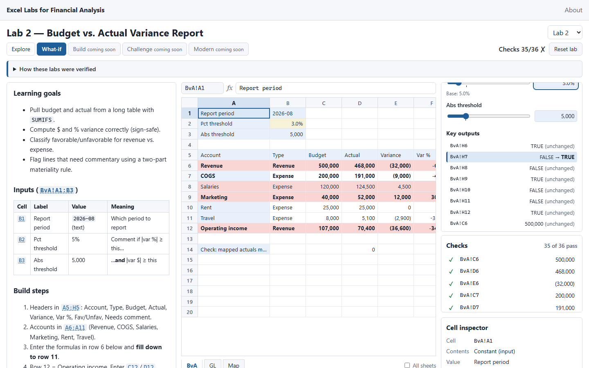
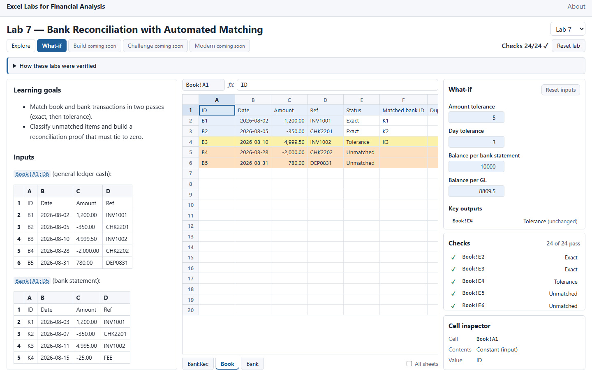
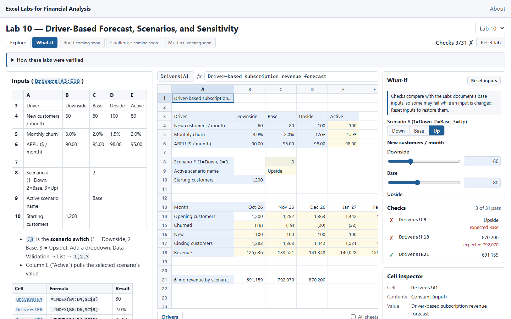
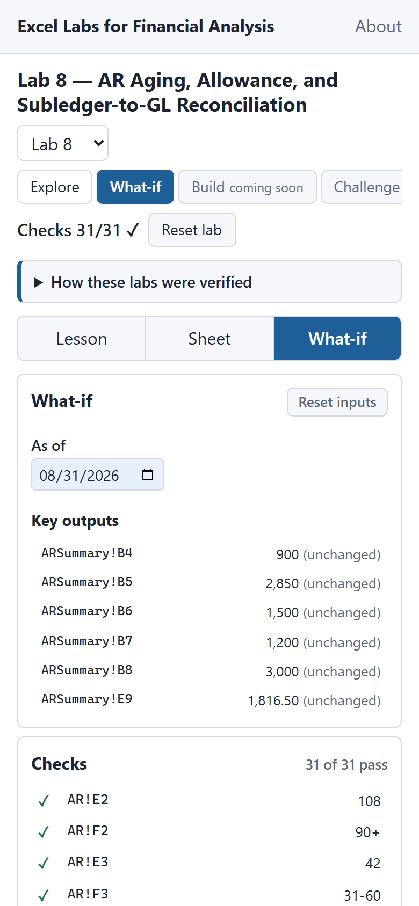

# Milestone 3: What-if + Challenge

M3 ships as two PRs from one approved plan (OPEN_ISSUES #28–#33, PRD v1.6 §12):

| Part | Branch | Scope | Status |
|---|---|---|---|
| **M3a** | `m3a-whatif` | What-if controls (WI-1–WI-4), GR-12 conditional formatting, formula-bar commit on blur, tooltips on cut-off labels, home banner | Complete locally; awaiting owner review |
| **M3b** | `m3b-challenge` (branched after M3a merges) | Challenge cards (CH-1–CH-4), charts CT-1–CT-4, GR-7 precedent outlines, LS-2 / LS-3, EX-2(c) (#26) | Not started |

---

## M3a: What-if mode

**Branch:** `m3a-whatif` · **Date:** 2026-09-30

**Exit criterion (PRD §11 #5):** every Appendix B.4 control exists and moves its cell, and experiments E2.1, E7.1, E9.1, and E10.1 reproduce their documented values when driven through the controls. **Met**, and exceeded: an e2e test drives **all 12** experiments through the controls and checks every `expect` cell.

### Screenshots

| Lab 2: % threshold lowered to 3% | Lab 7: conditional formats on `Book` |
|---|---|
|  |  |

| Lab 10: Upside scenario | Phone: Lab 8 What-if tab |
|---|---|
|  |  |

Regenerate with `npm run build:pages` and then `npm run screenshots:m3`.

### What works

- **Mode tabs.**
  - Explore and What-if are live. `?mode=whatif` is a deep link (`/#/lab/7?mode=whatif`), and switching tabs updates the URL.
  - Labs 1, 11, and 12 have no controls, so their What-if tab is disabled with "no controls in this lab".
  - Build, Challenge, and Modern still show "coming soon".
- **Controls (WI-1)** use the approved ranges (OPEN_ISSUES #28) in `src/config/labs.config.ts`:

  | Type | Where |
  |---|---|
  | Sliders, each with a typed value box ("3%", "0.03", "1,000") and a tick at the base value | Labs 2, 3, 10 |
  | Dropdowns | `BvA!B1`, `PivotLab!B2`, `PivotLab!B3` |
  | Number boxes | Labs 5, 7 |
  | Date picker | `AR!H2` |
  | Down / Base / Up segmented control | `Drivers!C8` |
  | Editable tables | `PVM!B5:E7`; the 30-month `Forecast!C5:C34` series, collapsed |

  - Every label is read from the workbook's own label cell (for example "Pct threshold" from `BvA!A2`), so no label text is invented.
  - A "Base: …" note appears when a value differs from the Labs document.
- **Live recalculation (WI-2).** A control writes through the engine, and changed cells flash (GR-6). Slider drags are coalesced to one write per animation frame, well under the 50 ms limit.
- **Key outputs (WI-2).** The panel lists every cell that the lab's experiments watch (Appendix E `expect`) as "before → **now**" or "(unchanged)". Clicking a row selects that cell.
- **Inject outlier (WI-3).** Lab 9's button applies E9.1's change, read from `experiments.json`, and becomes "Remove outlier", which restores the previous value.
- **Reset inputs (WI-4).** Restores every control cell in one recalculation and one undo step.
- **Checks note (OPEN_ISSUES #34).** While an input differs from its base, the panel explains that checks compare with the base inputs, so some may fail.
- **Conditional formatting (GR-12).** Rules come from the lessons' "Excel UI features" and are evaluated by the engine (PRD §9.3):
  - Relative references shift per cell, as in Excel.
  - Lab 2: `=$G6="Unfavorable"` → red fill; `=$H6=TRUE` → bold.
  - Lab 7: `Book!A2:G6` Unmatched → orange, Tolerance → yellow; `BankRec!B20` green when `B19=0`, otherwise red.
  - Lab 8: green → red color scale on `AR!E2:E7`.
  - Each rule's meaning is also in the cell text, so color is never the only cue. Colors have dark-mode tokens.
  - The rules belong to their sheet, so they also show when another lab displays that sheet under "All sheets".
- **Formula bar commits on blur.** An unsaved edit commits to the cell it was typed for when focus leaves, including when a click has already selected another cell or you switch sheets. Esc discards it. A rejected entry shows its message. This fixes the M2 known issue.
- **Tooltips on cut-off labels.** Hovering over text cut off by the column width shows the full text; text that fits gets no tooltip.
- **Home banner and README** say that Explore and What-if work and that Challenge and Build come next (OPEN_ISSUES #33).

### Engine and store changes

- **`FormulaEngine.setCells(entries)`** writes several cells in one HyperFormula `batch`: one recalculation and one undo step. All entries are validated first, so a bad entry changes nothing.
- **`FormulaEngine.evaluate(formula, sheet)`** evaluates a formula without storing it (HyperFormula `calculateFormula`), for conditional formats. Parse errors and unknown sheets return an error value instead of throwing.
- **`WorkbookStore`** adds:
  - `enterMany` (flashes changed cells).
  - `baseValue`: the Labs document's values, captured when the store is created.
  - `originalContent`: for "Reset inputs".
  - `evaluate`.

### Tests added

- **Unit (20 new; 502 total):**
  - `tests/whatif.test.ts`:
    - It parses **Appendix B.4** from the Labs document and requires every listed cell to have a control in the lab that lists it.
    - Controls write only constants, reach every experiment change in their lab, and include the base and every experiment value in their range (sliders land exactly on them).
    - Churn never reaches 0, and every label cell holds text.
    - Key outputs match Appendix E.
    - Conditional formats: reference shifting, plus Labs 2, 7 (including E7.2 turning `B20` red), and 8, checked against the engine's own values.
  - `tests/engine.test.ts`: `setCells` (one undo step; all or nothing) and `evaluate`.
  - `tests/workspace.test.ts`: `enterMany`, `baseValue`, `originalContent`, and `evaluate`.
- **E2E (34 new; 65 total):**
  - `whatif.spec.ts`:
    - The deep link and mode switching.
    - What-if is disabled in Labs 1, 11, and 12.
    - Every control in every lab moves its cell, and Reset inputs puts it back.
    - **All 12 experiments are reproduced through the controls.**
    - Inject outlier and its undo.
    - The key-outputs list and the checks note.
    - A conditional format reacts to E7.2.
    - **axe-core: no serious or critical violations in What-if mode** (Lab 10).
  - `formula-bar.spec.ts`: commit on clicking another cell, commit on switching sheets, Esc discards, a rejected entry is explained, and the tooltip appears only on cut-off text.

### Verification (`/verify`, local, 2026-09-30)

| Step | Result |
|---|---|
| `npm run extract -- --check` | 21 files up to date |
| Golden cross-check | 15/15 sheets, 277/277 assertions, 12/12 experiments deep-equal (18 tests) |
| `npm run lint` / `typecheck` | Pass / pass |
| `npm test` + `verification:write` | **assertions 277/277, experiments 12/12**; 502/502 tests in 12 files |
| `npm run build:pages` | Initial JS **137.9 KB gzipped** (budget 600 KB). Lazy: lab route 40.8 KB (was 34.9), engine 173.3 KB, lessons 1.2–3.7 KB |
| `npm run test:e2e` | 65/65 passed; 7 skipped (the screenshot specs) |

PRD §11: **#1, #2, #3, #5 met.** #6 (Challenge) is M3b. #4 and #7–#15 belong to later milestones.

### Decisions made for M3a

All are recorded in OPEN_ISSUES #28–#36:

- **Control ranges approved.** `CostVar!B18`/`B19` use `#,##0.00`, and Lab 6 has period and version dropdowns (#28).
- **Lab 7's add-a-row toggle is not built** (#29).
- **Conditional formats:** Lab 8's color scale is included and Lab 2's icon set skipped (#30).
- **Banner wording** reflects that What-if is now live (#33).
- **The key outputs come from Appendix E** (#35).
- **Each slider step is an undo step** (#36, open).

No new dependencies.

### Known issues

- **Each slider write is its own undo step** (OPEN_ISSUES #36). "Reset inputs" is the one-step way back.
- **The right column is tight at 900 px tall.** The What-if panel takes up to 65% of the column and scrolls, so the key outputs are often below the fold in labs with many controls (Labs 5 and 10).
- **Number boxes show raw numbers** (`10000`, `8809.5`), because `<input type="number">` can't display Excel formats. The grid shows the formatted value.
- **Rejected control values show their message above the grid.** On a phone that's in the Sheet tab, not the What-if tab. (Controls rarely produce errors: their ranges are bounded.)
- Carried over: OPEN_ISSUES #15 (TypeScript 6.0.x pin) and #18 (plugin scope limits). #26 (EX-2c) is scheduled for M3b.

### Next

- **Owner:** review the M3a PR and screenshots.
- **After merge:** branch `m3b-challenge` for challenge cards, the four SVG charts, GR-7, LS-2/LS-3, and EX-2(c).
